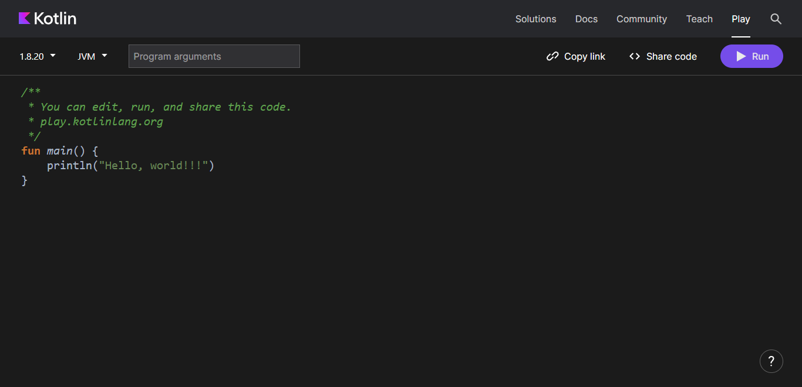

# Fundamental Kotlin

## Kotlin Playground

Untuk mencoba kode-kode yang ada pada modul ini, Anda bisa menggunakan [Kotlin Playground](https://play.kotlinlang.org/). Kotlin Playground adalah sebuah website yang menyediakan layanan untuk menulis kode Kotlin dan menjalankannya secara langsung. Anda bisa langsung mencoba kode-kode yang ada pada modul ini di Kotlin Playground.



## Hello Kotlin

Sebelum ke topik-topik fundamental, mari kita awali dengan pembahasan tentang program Hello Kotlin!. Pada sub-modul sebelumnya kita telah berjumpa dengan sebuah proyek yang menampilkan sebuah teks Hello World! dan juga Hello Kotlin!.

Buat Anda yang pernah belajar pemrograman sebelumnya, tentu tak asing dengan program ini. Hello World! sering digunakan untuk menunjukkan sintaks dasar pada sebuah bahasa pemrograman. Karena kita sedang belajar bahasa pemrograman Kotlin, maka kita mengganti namanya dengan Hello Kotlin!.

Hello Kotlin! merupakan sebuah program sederhana yang digunakan untuk mencetak sebuah teks “Hello Kotlin!” ke dalam layar atau konsol. Berikut adalah contoh kode dari program tersebut:

```kotlin
fun main() {
  println("Hello Kotlin!")
}
```

Baris pertama dari kode di atas adalah komentar yang ditandai dengan tanda `//`.

Sebuah komentar akan dilewatkan ketika proses kompilasi, sehingga tidak akan mempengaruhi alur program yang kita tulis. Komentar bisa kita gunakan untuk mendokumentasikan kode yang kita tulis agar ketika suatu saat kita membukanya kembali, kita bisa mengetahui fungsi dari kode yang kita beri komentar tersebut.

Kemudian fungsi `println()`, fungsi yang akan kita gunakan untuk mencetak teks ke dalam layar atau konsol. Fungsi `println()` membutuhkan satu argumen berupa message dengan tipe data yang dikehendaki.Selain fungsi `println()`, terdapat juga fungsi print() yang berfungsi sama seperti fungsi `println()`. Bedanya, `println()` akan menambahkan baris baru setelah selesai mencetak argumen yang diberikan, sementara fungsi print() tidak melakukan apapun ketika argumen yang diberikan, selesai dicetak. Untuk memahaminya lebih dalam, coba jalankan kode berikut:

```kotlin
fun main() {
  val name = "Reski Mulud Muchamad"
 
  print("Hello my name is ")
  println(name)
  print(if (true) "Always true" else "Always false")
}
 
/*
  output:
    Hello my name is Reski Mulud Muchamad
    Always true
*/
```

**[<< Sebelumnya](instalasi.md)**  | **[Selanjutnya >>](m2-datatype-variable.md)**
