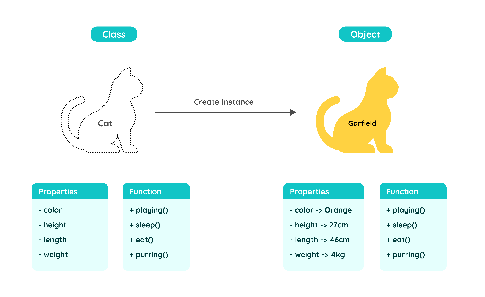

# Konsep Object-Oriented Programming (Pemrograman Berorientasi Objek)

## Apa itu OOP?

OOP masih menjadi salah satu paradigma atau teknik pemrograman yang banyak digunakan dalam pengembangan aplikasi. Dalam pemrograman dengan pendekatan OOP, kita akan menemukan beberapa istilah seperti **Class**, **Attribute** (atau **Properties**), dan **Function** (atau **Method**). Penting untuk diingat bahwa setiap bahasa pemrograman memiliki terminologi yang berbeda-beda, meskipun maknanya mungkin sama atau sangat berbeda. Sebagai contoh, istilah properti atau atribut dapat memiliki makna yang sama, meskipun namanya berbeda. Biasanya, programmer lebih sering menggunakan atribut untuk istilah yang berkaitan dengan mekanisme atau proses yang dilakukan oleh objek, dan menggunakan istilah properti untuk mendeskripsikan karakteristik dari sebuah objek. Dengan paradigma OOP kita dapat mudah memvisualisasikan kode karena OOP sendiri mirip seperti skenario dalam kehidupan nyata. Dalam penerapan OOP kita menggabungkan kumpulan-kumpulan fungsi atau atribut yang memiliki kesamaan dalam sebuah unit yang kita sebut sebagai objek.

Gambaran visual di atas memberikan konsep umum tentang OOP, yang meliputi blueprint Kucing, atribut yang dimilikinya, dan kemampuan yang dapat dilakukannya. Dalam paradigma pemrograman Berorientasi Objek (OOP), sebuah class adalah sebuah blueprint yang dapat digunakan untuk membuat objek. Blueprint ini merupakan sebuah template yang menjelaskan perilaku objek tersebut dalam bentuk properti atau fungsi. Dalam dunia pemrograman, terutama dalam paradigma OOP, kita sering membuat banyak objek dengan jenis yang sama. Dengan menggunakan blueprint ini, kita dapat mengurangi duplikasi kode dalam pembuatan objek yang serupa.

* **Class**: Merupakan sebuah blueprint yang terdapat properti dan fungsi di dalamnya
* **Properties**: Karakteristik dari sebuah kelas, memiliki tipe data.
* **Functions**: Kemampuan atau aksi dari sebuah kelas.

**[<< Sebelumnya](m12-oop.md)**  | **[Selanjutnya >>](m13-class-object.md)**
