# Latihan RecyclerView

## Tujuan Latihan RecyclerView

Pada latihan ini memiliki tujuan yaitu untuk memahami cara penggunaan RecyclerView pada Android. Pada latihan ini kita akan membuat aplikasi yang menampilkan daftar album musik. Adapun poin-poin tujuannya adalah sebagai berikut:

* Memahami cara penggunaan RecyclerView
* Memahami cara penggunaan Adapter pada RecyclerView
* Memahami cara penggunaan ViewHolder pada RecyclerView
* Memahami cara penggunaan Glide untuk menampilkan gambar pada RecyclerView

Contoh dari RecyclerView yang akan kita buat dalam dalam bentuk _list_ dengan bentuk kartu menggunakan **cardview**, di mana semuanya berada dalam satu halaman saja.

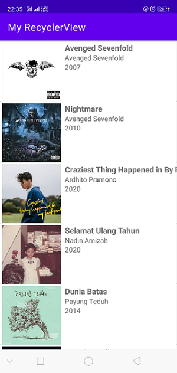

## Alur Latihan RecyclerView

Pada latihan ini kita akan membuat aplikasi yang menampilkan daftar album musik. Adapun alur dari latihan ini adalah sebagai berikut:

1. Menyiapkan project
2. Membuat layout untuk item RecyclerView
3. Membuat layout untuk RecyclerView
4. Membuat data dummy
5. Membuat adapter untuk RecyclerView
6. Membuat ViewHolder untuk RecyclerView
7. Menghubungkan adapter dengan RecyclerView
8. Menampilkan data pada RecyclerView

## Menyiapkan project

Pertama-tama kita akan membuat project baru dengan nama **MyRecyclerView**. Pada project ini kita akan menggunakan bahasa pemrograman Kotlin. Untuk membuat project baru, silahkan ikuti langkah-langkah berikut:

1. Buat project baru dengan struktur seperti berikut:
| Nama Project | **MyRecyclerView** |
| :--- | :--- |
| Target Minimum Android | **API 24: Android 7.0 (Nougat)** |
| Tipe Activity | **Empty Activity** |
| Language | **Kotlin** |

2. Sembari menunggu proses build gradle selesai, unduh assets yang dibutuhkan pada latihan ini dengan cara mengunjungi link berikut: [File Assets](https://drive.google.com/file/d/1iVADp1E-xzbO_oV7H1L4V3CXZoFs5Otj/view?usp=sharing). Kemudian ekstrak file tersebut dan simpan pada folder yang mudah dijangkau. Setelah selesai di extract, salin semua file gambar yang ada di dalam folder **assets** ke folder **res/drawable** pada project **MyRecyclerView**.

  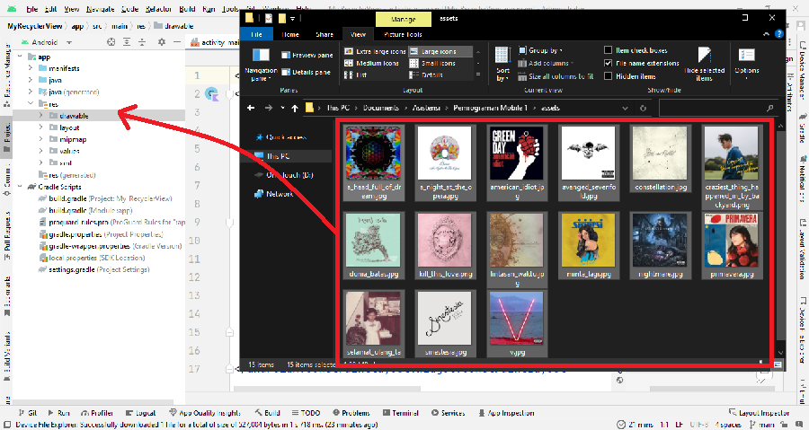

  Lalu pilih destination directory yang **res/drawable** (bukan **res/drawable-v24**). Lalu klik **OK**.

  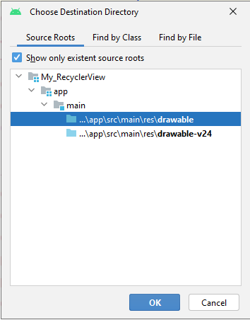

  Lalu klik **OK** lagi.

  Jika sudah selesai, maka folder **drawable** pada project **MyRecyclerView** akan terlihat seperti berikut:

  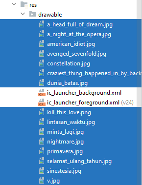

3. Selanjutnya, tambahkan library Glide pada project **MyRecyclerView** dengan cara menambahkan kode berikut pada file **build.gradle** pada module **app**:

  ```build.gradle
  dependencies {
    implementation 'com.github.bumptech.glide:glide:4.15.1'
  }
  ```

  Kemudian klik **Sync Now** pada bagian kanan atas layar Android Studio.

  > Glide adalah library yang digunakan untuk menampilkan gambar pada Android. Glide memiliki fitur-fitur yang lebih lengkap dibandingkan dengan library lainnya. Untuk informasi lebih lanjut mengenai Glide, silahkan kunjungi [Glide](https://bumptech.github.io/glide/).

## Membuat layout untuk item RecyclerView

Kini saatnya kita membuat sebuah item tampilan dalam bentuk berkas _layout_ xml yang akan ditampilkan di RecyclerView. Karena data pertama kali akan ditampilkan dalam bentuk _list_, maka kita buat _layout_ dengan cara klik kanan pada direktori **layout** → **new** → **layout resource file** dan kemudian beri nama **layout_item**. Pastikan **Root element** menggunakan **ConstraintLayout** terlebih dahulu.

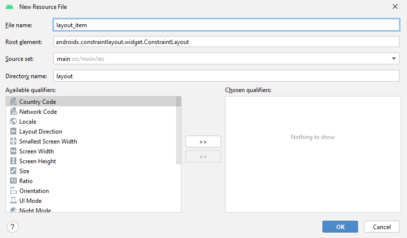

Setelah terbentuk file layout baru, maka kita akan mengubah _layout_ tersebut menjadi seperti berikut:

> Namun biasakan untuk mengetiknya sendiri, jangan langsung copy-paste yaa.

```layout_item.xml
<?xml version="1.0" encoding="utf-8"?>
<androidx.cardview.widget.CardView xmlns:android="http://schemas.android.com/apk/res/android"
    xmlns:app="http://schemas.android.com/apk/res-auto"
    xmlns:tools="http://schemas.android.com/tools"
    android:layout_width="match_parent"
    android:layout_height="wrap_content">

    <androidx.constraintlayout.widget.ConstraintLayout
        android:layout_width="match_parent"
        android:layout_height="match_parent">

        <ImageView
            android:id="@+id/iv_album_picture"
            android:layout_width="120dp"
            android:layout_height="120dp"
            android:layout_margin="4dp"
            app:layout_constraintStart_toStartOf="parent"
            app:layout_constraintTop_toTopOf="parent"
            tools:src="@tools:sample/avatars"/>

        <TextView
            android:id="@+id/tv_title"
            android:layout_width="wrap_content"
            android:layout_height="wrap_content"
            android:text="Title"
            android:layout_marginStart="8dp"
            android:textSize="16sp"
            android:textStyle="bold"
            app:layout_constraintStart_toEndOf="@+id/iv_album_picture"
            app:layout_constraintTop_toTopOf="@+id/iv_album_picture" />

        <TextView
            android:id="@+id/tv_artist"
            android:layout_width="wrap_content"
            android:layout_height="wrap_content"
            android:text="Artist"
            app:layout_constraintStart_toStartOf="@+id/tv_title"
            app:layout_constraintTop_toBottomOf="@+id/tv_title" />

        <TextView
            android:id="@+id/tv_year"
            android:layout_width="wrap_content"
            android:layout_height="wrap_content"
            android:text="Year"
            app:layout_constraintStart_toStartOf="@+id/tv_artist"
            app:layout_constraintTop_toBottomOf="@+id/tv_artist" />

    </androidx.constraintlayout.widget.ConstraintLayout>

</androidx.cardview.widget.CardView>
```

Jangan lupa untuk mengekstrak string yang terdapat pada tag `android:text` dengan cara menekan tombol **Alt + Enter** pada keyboard dan pilih **Extract string resource**.

Maka tampilan dari _layout_ tersebut akan menjadi seperti berikut:


## Membuat layout untuk RecyclerView

Kemudian kita akan membuat _layout_ untuk RecyclerView. Karena RecyclerView akan ditampilkan di dalam _layout_ MainActivity, maka buka file **activity_main.xml** dan ubah _layout_ tersebut menjadi seperti berikut:

```activity_main.xml
<?xml version="1.0" encoding="utf-8"?>
<androidx.constraintlayout.widget.ConstraintLayout xmlns:android="http://schemas.android.com/apk/res/android"
    xmlns:app="http://schemas.android.com/apk/res-auto"
    xmlns:tools="http://schemas.android.com/tools"
    android:layout_width="match_parent"
    android:layout_height="match_parent"
    tools:context=".MainActivity">

    <androidx.recyclerview.widget.RecyclerView
        android:id="@+id/rv_albums"
        android:layout_width="match_parent"
        android:layout_height="match_parent"
        app:layout_constraintStart_toStartOf="parent"
        app:layout_constraintTop_toTopOf="parent"
        tools:listitem="@layout/layout_item" />

</androidx.constraintlayout.widget.ConstraintLayout>
```

Perhatikan, selain menambahkan RecyclerView, kita juga perlu mengatur posisi dari Constraint Layout, serta menambahkan id dari RecyclerView yakni `android:id="@+id/rv_albums"`. Selain itu, kita juga perlu menambahkan atribut `tools:listitem="@layout/layout_item"` pada RecyclerView. Atribut tersebut digunakan untuk menampilkan _layout_ item pada preview layout.

Maka tampilan dari _layout_ tersebut akan menjadi seperti berikut:

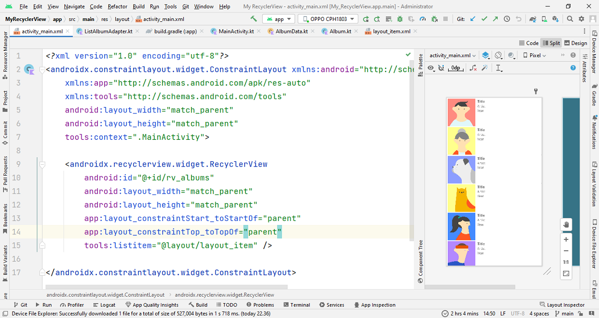

## Membuat model data

Kemudian kita akan membuat sebuah model data yang akan digunakan untuk menampung data yang akan ditampilkan di RecyclerView. Pertama, buat package baru dengan cara klik kanan pada direktori **root package kalian** → **new** → **package** dan beri nama **model**.

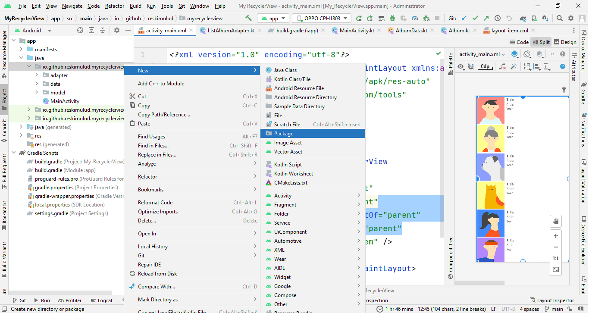

> Cukup tuliskan **model** di akhir nama package, jangan hapus tulisan sebelumnya.

Selanjutnya, buat sebuah **data class** baru dengan cara klik kanan pada package **model** → **new** → **Kotlin file/class** dan beri nama **Album**, dan pilih bagian **Data Class**.

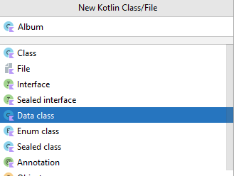

Dan ikuti kode di bawah ini untuk membuat model data class Album:

> Jangan menghapus kode yang sudah ada seperti `package` yang ada di baris awal, cukup tambahkan kode yang baru saja dituliskan.

```Album.kt
data class Album(
    var id: Int = 0,
    var albumNames: String = "",
    var albumArtist: String = "",
    var year: String = "",
    var release: String = "",
    var songs: Int = 0,
    var duration: String = "",
    var genre: String = "",
    var description: String = "",
    var label: String = "",
    var cover: Int = 0,
)
```

## Membuat data dummy

Kemudian kita akan membuat data dummy yang akan digunakan untuk menampilkan data di RecyclerView. Buat package baru dengan cara klik kanan pada direktori **root package kalian** → **new** → **package** dan beri nama **data**.

Setelah itu buat sebuah **object** baru dengan cara klik kanan pada package **data** → **new** → **Kotlin file/class** dan beri nama **AlbumData**, dan pilih bagian **Object**.

Buka file **AlbumData.txt** pada berkas yang telah di unduh sebelumnya, dan salin semua kode yang ada di dalamnya. Kemudian buka file **AlbumData.kt** yang telah dibuat tadi, dan ganti kode yang ada dengan kode yang telah disalin tadi.

## Membuat adapter

Kemudian kita akan membuat adapter untuk RecyclerView. Buat package baru dengan cara klik kanan pada direktori **root package kalian** → **new** → **package** dan beri nama **adapter**.

Selanjutnya, buat sebuah **class** baru dengan cara klik kanan pada package **adapter** → **new** → **Kotlin file/class** dan beri nama **ListAlbumAdapter**, dan pilih bagian **Class**.

Setelah class **ListAlbumAdapter** dibuat, lengkapi kode nya menjadi seperti sebagai berikut:

```ListAlbumAdapter.kt
class ListAlbumAdapter: RecyclerView<ListAlbumAdapter.ViewHolder>() {

}
```

Jika bagian `RecyclerView` masih berwarna merah, maka jangan lupa untuk mengimport class `RecyclerView` dengan cara menekan tombol **Alt + Enter** pada keyboard dan pilih **Import class**.

Kemudian akan terdapat warna merah pada kode, yaitu pada `ViewHolder`. Kita resolve satu per satu. Pertama adalah kita tekan **alt+enter / klik tombol merah** pada `ViewHolder` dan pilih **Create class ViewHolder**, kemudian pilih **ListAlbumAdapter**  karena kita akan membuat sebuah inner class:

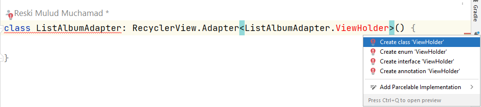

Kemudian pilih **ListAlbumAdapter** untuk membuat class ViewHolder di dalam class ListAlbumAdapter.

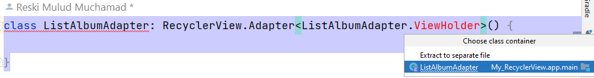

Sehingga kode yang kita buat menjadi seperti ini:

```ListAlbumAdapter.kt
class ListAlbumAdapter: RecyclerView<ListAlbumAdapter.ViewHolder>() {

    class ViewHolder() {

    }
}
```

Masih ada merah-nya. Seharusnya class ViewHolder inherit ke class RecyclerView.ViewHolder. Maka ubah kode nya seperti ini:

```ListAlbumAdapter.kt
class ListAlbumAdapter: RecyclerView<ListAlbumAdapter.ViewHolder>() {

    class ViewHolder() : RecyclerView.ViewHolder {

    }
}
```

Sekarang kembali masih ada merah pada `RecyclerView.ViewHolder`. Kita tekan **alt+enter / klik tombol merah** pada `RecyclerView.ViewHolder` dan pilih **Add constructor parameters from ViewHolder(View)**.

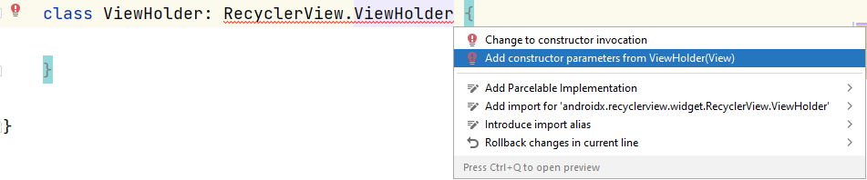

Maka kode yang kita buat menjadi seperti ini:

```ListAlbumAdapter.kt
class ListAlbumAdapter: RecyclerView<ListAlbumAdapter.ViewHolder>() {

    class ViewHolder(itemView: View) : RecyclerView.ViewHolder(itemView) {

    }
}
```

Masih terdapat merah pada bagian **class ListAlbumAdapter**. Kita tekan **alt+enter / klik tombol merah** pada **class ListAlbumAdapter** dan pilih **Implement members**.

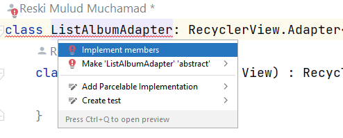

Kemudian pilih ketiga opsi yang ada, yaitu `onCreateViewHolder`, `onBindViewHolder`, dan `getItemCount`, lalu klik **Ok**.

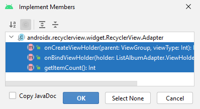

Maka kode yang kita buat menjadi seperti ini:

```ListAlbumAdapter.kt
class ListAlbumAdapter: RecyclerView<ListAlbumAdapter.ViewHolder>() {

    class ViewHolder(itemView: View) : RecyclerView.ViewHolder(itemView) {

    }

    override fun onCreateViewHolder(parent: ViewGroup, viewType: Int): ViewHolder {
        TODO("Not yet implemented")
    }

    override fun onBindViewHolder(holder: ViewHolder, position: Int) {
        TODO("Not yet implemented")
    }

    override fun getItemCount(): Int {
        TODO("Not yet implemented")
    }
}
```

Setelah itu kita buat properties `listAlbum` dengan tipe data `ArayList<Album>` sebagai data yang akan ditampilkan di RecyclerView. Lalu buat pula method/function untuk mengisi data ke dalam `listAlbum` tersebut dengan nama `setData`. Tambahkan kode berikut pada class **ListAlbumAdapter**:

```ListAlbumAdapter.kt
class ListAlbumAdapter: RecyclerView<ListAlbumAdapter.ViewHolder>() {

    private val listAlbum = ArrayList<Album>()

    fun setData(items: ArrayList<Album>) {
        listAlbum.clear()
        listAlbum.addAll(items)
        notifyDataSetChanged()
    }
}
```

Sekarang kita akan fokus terlebih dahulu kepada class **ViewHolder**. Maka lengkapi class **ViewHolder** menjadi seperti ini:

```ListAlbumAdapter.kt
class ListAlbumAdapter: RecyclerView<ListAlbumAdapter.ViewHolder>() {

    class ViewHolder(itemView: View) : RecyclerView.ViewHolder(itemView) {
        private val ivAlbumPicture: ImageView = itemView.findViewById(R.id.iv_album_picture)
        private val tvTitle: TextView = itemView.findViewById(R.id.tv_title)
        private val tvArtist: TextView = itemView.findViewById(R.id.tv_artist)
        private val tvYear: TextView = itemView.findViewById(R.id.tv_year)

        fun bind(data: Album) {
            data.apply {
                Glide.with(itemView.context)
                    .load(cover)
                    .into(ivAlbumPicture)
                tvTitle.text = albumNames
                tvArtist.text = albumArtist
                tvYear.text = year
            }
        }
    }
}
```

Di dalam class ViewHolder kita akan menginisialisasi view yang ada di layout item_album.xml. Kemudian kita akan mengisi data ke dalam view tersebut dengan menggunakan method/function `bind`. Dan untuk memasukkan gambar ke dalam ImageView kita menggunakan library Glide.

Selanjutnya kita akan fokus ke method/function `onCreateViewHolder`. Lengkapi kode pada method/function `onCreateViewHolder` menjadi seperti ini:

```ListAlbumAdapter.kt
class ListAlbumAdapter: RecyclerView<ListAlbumAdapter.ViewHolder>() {

    override fun onCreateViewHolder(parent: ViewGroup, viewType: Int): ViewHolder {
        val view = LayoutInflater.from(parent.context).inflate(R.layout.layout_item, parent, false)
        return ViewHolder(view)
    }

}
```

Method `onCreateViewHolder` akan membuat view baru yang akan digunakan oleh RecyclerView untuk menampilkan data. Kita menggunakan method `inflate` untuk membuat view baru. Dan kita akan mengembalikan object ViewHolder yang telah kita buat tadi.

Selanjutnya kita akan fokus ke method/function `onBindViewHolder`. Lengkapi kode pada method/function `onBindViewHolder` menjadi seperti ini:

```ListAlbumAdapter.kt
class ListAlbumAdapter: RecyclerView<ListAlbumAdapter.ViewHolder>() {

    override fun onBindViewHolder(holder: ViewHolder, position: Int) {
        val data = listAlbum[position]
        holder.bind(data)
    }

}
```

Method `onBindViewHolder` akan menghubungkan data dengan view yang akan ditampilkan di RecyclerView. Kita akan menghubungkan data dengan view yang ada di class ViewHolder dengan memanggil method/function `bind` yang sudah kita buat tadi.

Selanjutnya kita akan fokus ke method/function `getItemCount`. Lengkapi kode pada method/function `getItemCount` menjadi seperti ini:

```ListAlbumAdapter.kt
class ListAlbumAdapter: RecyclerView<ListAlbumAdapter.ViewHolder>() {

    override fun getItemCount(): Int = listAlbum.size

}
```

Method `getItemCount` akan mengembalikan jumlah data yang akan ditampilkan di RecyclerView.

Maka secara keseluruhan, class **ListAlbumAdapter** akan menjadi seperti ini:

```ListAlbumAdapter.kt
class ListAlbumAdapter: RecyclerView<ListAlbumAdapter.ViewHolder>() {

    private val listAlbum = ArrayList<Album>()

    fun setData(items: ArrayList<Album>) {
        listAlbum.clear()
        listAlbum.addAll(items)
        notifyDataSetChanged()
    }

    class ViewHolder(itemView: View) : RecyclerView.ViewHolder(itemView) {
        private val ivAlbumPicture: ImageView = itemView.findViewById(R.id.iv_album_picture)
        private val tvTitle: TextView = itemView.findViewById(R.id.tv_title)
        private val tvArtist: TextView = itemView.findViewById(R.id.tv_artist)
        private val tvYear: TextView = itemView.findViewById(R.id.tv_year)

        fun bind(data: Album) {
            data.apply {
                Glide.with(itemView.context)
                    .load(cover)
                    .into(ivAlbumPicture)
                tvTitle.text = albumNames
                tvArtist.text = albumArtist
                tvYear.text = year
            }
        }
    }

    override fun onCreateViewHolder(parent: ViewGroup, viewType: Int): ViewHolder {
        val view = LayoutInflater.from(parent.context).inflate(R.layout.layout_item, parent, false)
        return ViewHolder(view)
    }

    override fun onBindViewHolder(holder: ViewHolder, position: Int) {
        val data = listAlbum[position]
        holder.bind(data)
    }

    override fun getItemCount(): Int = listAlbum.size

}
```

## Menghubungkan RecyclerView dengan Adapter pada MainActivity

Setelah membuat adapter, selanjutnya kita akan menghubungkan RecyclerView dengan adapter yang sudah kita buat tadi. Kita akan menghubungkannya pada class **MainActivity**. Tambahkan kode berikut pada class **MainActivity** untuk membuat properties `rvAlbums` dan `listAlbumAdapter`:

```MainActivity.kt
class MainActivity : AppCompatActivity() {

    private lateinit var rvAlbums: RecyclerView
    private lateinit var listAlbumAdapter: ListAlbumAdapter

    override fun onCreate(savedInstanceState: Bundle?) {
        super.onCreate(savedInstanceState)
        setContentView(R.layout.activity_main)

        rvAlbums = findViewById(R.id.rv_albums)
        listAlbumAdapter = ListAlbumAdapter()
    }
}
```

Kedua properties tersebut menggunakan keyword `lateinit` karena kita akan menginisialisasikan properties tersebut pada method `onCreate`. Selanjutnya kita akan menghubungkan RecyclerView dengan adapter yang sudah kita buat tadi. Buat function baru dengan nama `showRecyclerList` dan tambahkan kode berikut pada function tersebut:

```MainActivity.kt
class MainActivity : AppCompatActivity() {

    private lateinit var rvAlbums: RecyclerView
    private lateinit var listAlbumAdapter: ListAlbumAdapter

    override fun onCreate(savedInstanceState: Bundle?) {
        super.onCreate(savedInstanceState)
        setContentView(R.layout.activity_main)

        rvAlbums = findViewById(R.id.rv_albums)
        listAlbumAdapter = ListAlbumAdapter()

        showRecyclerList()
    }

    private fun showRecyclerList() {
        rvAlbums.layoutManager = LinearLayoutManager(this)
        rvAlbums.adapter = listAlbumAdapter

        listAlbumAdapter.setData(listData)
    }
}
```

Pada function `showRecyclerList` kita akan mengatur layout manager dan adapter untuk RecyclerView. Kemudian kita akan memanggil method/function `setData` untuk mengisi data ke dalam RecyclerView. Dan data yang akan kita masukkan ke dalam RecyclerView adalah data yang ada di variable `listData` dari object **AlbumData**. Jika variable `listData` error, maka jangan lupa untuk mengimport variable tersebut dengan cara menekan tombol `Alt + Enter` pada variable `listData` tersebut.

## Jalankan Aplikasi

Setelah itu jalankan aplikasi untuk memastikan apakah RecyclerView sudah berjalan dengan baik, kita akan menjalankan aplikasi. Jika aplikasi sudah berjalan dengan baik, maka hasilnya akan seperti ini:


---

Selamat, kita telah berhasil membuat RecyclerView pada Android Studio. Sekarang kita sudah bisa membuat RecyclerView dengan mudah.

Kode tersebut juga telah disimpan di repository GitHub. Jika ingin melihat kode lengkapnya, silahkan kunjungi repository GitHub berikut: [GitHub Project MyRecyclerView](https://github.com/mankart/recyclerview)

---

**[<< Sebelumnya](recyclerview.md)**  | Selanjutnya >>
