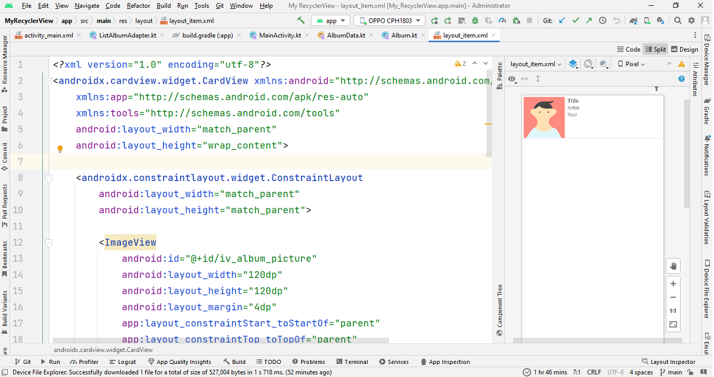

# Latihan RecyclerView

[GitHub Project RecyclerView](https://github.com/mankart/recyclerview)

## Tujuan Latihan RecyclerView

Pada latihan ini memiliki tujuan yaitu untuk memahami cara penggunaan RecyclerView pada Android. Pada latihan ini kita akan membuat aplikasi yang menampilkan daftar album musik. Adapun poin-poin tujuannya adalah sebagai berikut:

* Memahami cara penggunaan RecyclerView
* Memahami cara penggunaan Adapter pada RecyclerView
* Memahami cara penggunaan ViewHolder pada RecyclerView
* Memahami cara penggunaan Glide untuk menampilkan gambar pada RecyclerView

Contoh dari RecyclerView yang akan kita buat dalam dalam bentuk _list_ dengan bentuk kartu menggunakan **cardview**, di mana semuanya berada dalam satu halaman saja.


## Alur Latihan RecyclerView

Pada latihan ini kita akan membuat aplikasi yang menampilkan daftar album musik. Adapun alur dari latihan ini adalah sebagai berikut:

1. Menyiapkan project
2. Membuat layout untuk item RecyclerView
3. Membuat layout untuk RecyclerView
4. Membuat data dummy
5. Membuat adapter untuk RecyclerView
6. Membuat ViewHolder untuk RecyclerView
7. Menghubungkan adapter dengan RecyclerView
8. Menampilkan data pada RecyclerView

## Menyiapkan project

Pertama-tama kita akan membuat project baru dengan nama **MyRecyclerView**. Pada project ini kita akan menggunakan bahasa pemrograman Kotlin. Untuk membuat project baru, silahkan ikuti langkah-langkah berikut:

1. Buat project baru dengan struktur seperti berikut:
| Nama Project | **MyRecyclerView** |
| :--- | :--- |
| Target Minimum Android | **API 24: Android 7.0 (Nougat)** |
| Tipe Activity | **Empty Activity** |
| Language | **Kotlin** |

2. Sembari menunggu proses build gradle selesai, unduh assets yang dibutuhkan pada latihan ini dengan cara mengunjungi link berikut: [File Assets](https://drive.google.com/file/d/1iVADp1E-xzbO_oV7H1L4V3CXZoFs5Otj/view?usp=sharing). Kemudian ekstrak file tersebut dan simpan pada folder yang mudah dijangkau. Setelah selesai di extract, salin semua file gambar yang ada di dalam folder **assets** ke folder **res/drawable** pada project **MyRecyclerView**.

  

  Lalu pilih destination directory yang **res/drawable** (bukan **res/drawable-v24**). Lalu klik **OK**.

  

  Lalu klik **OK** lagi.

  Jika sudah selesai, maka folder **drawable** pada project **MyRecyclerView** akan terlihat seperti berikut:

  

3. Selanjutnya, tambahkan library Glide pada project **MyRecyclerView** dengan cara menambahkan kode berikut pada file **build.gradle** pada module **app**:

  ```build.gradle
  dependencies {
    implementation 'com.github.bumptech.glide:glide:4.15.1'
  }
  ```

  Kemudian klik **Sync Now** pada bagian kanan atas layar Android Studio.

  > Glide adalah library yang digunakan untuk menampilkan gambar pada Android. Glide memiliki fitur-fitur yang lebih lengkap dibandingkan dengan library lainnya. Untuk informasi lebih lanjut mengenai Glide, silahkan kunjungi [Glide](https://bumptech.github.io/glide/).

## Membuat layout untuk item RecyclerView

Kini saatnya kita membuat sebuah item tampilan dalam bentuk berkas _layout_ xml yang akan ditampilkan di RecyclerView. Karena data pertama kali akan ditampilkan dalam bentuk _list_, maka kita buat _layout_ dengan cara klik kanan pada direktori **layout** → **new** → **layout resource file** dan kemudian beri nama **layout_item**. Pastikan **Root element** menggunakan **ConstraintLayout** terlebih dahulu.


Setelah terbentuk file layout baru, maka kita akan mengubah _layout_ tersebut menjadi seperti berikut:

> Namun biasakan untuk mengetiknya sendiri, jangan langsung copy-paste yaa.

```layout_item.xml
<?xml version="1.0" encoding="utf-8"?>
<androidx.cardview.widget.CardView xmlns:android="http://schemas.android.com/apk/res/android"
    xmlns:app="http://schemas.android.com/apk/res-auto"
    xmlns:tools="http://schemas.android.com/tools"
    android:layout_width="match_parent"
    android:layout_height="wrap_content">

    <androidx.constraintlayout.widget.ConstraintLayout
        android:layout_width="match_parent"
        android:layout_height="match_parent">

        <ImageView
            android:id="@+id/iv_album_picture"
            android:layout_width="120dp"
            android:layout_height="120dp"
            android:layout_margin="4dp"
            app:layout_constraintStart_toStartOf="parent"
            app:layout_constraintTop_toTopOf="parent"
            tools:src="@tools:sample/avatars"/>

        <TextView
            android:id="@+id/tv_title"
            android:layout_width="wrap_content"
            android:layout_height="wrap_content"
            android:text="Title"
            android:layout_marginStart="8dp"
            android:textSize="16sp"
            android:textStyle="bold"
            app:layout_constraintStart_toEndOf="@+id/iv_album_picture"
            app:layout_constraintTop_toTopOf="@+id/iv_album_picture" />

        <TextView
            android:id="@+id/tv_artist"
            android:layout_width="wrap_content"
            android:layout_height="wrap_content"
            android:text="Artist"
            app:layout_constraintStart_toStartOf="@+id/tv_title"
            app:layout_constraintTop_toBottomOf="@+id/tv_title" />

        <TextView
            android:id="@+id/tv_year"
            android:layout_width="wrap_content"
            android:layout_height="wrap_content"
            android:text="Year"
            app:layout_constraintStart_toStartOf="@+id/tv_artist"
            app:layout_constraintTop_toBottomOf="@+id/tv_artist" />

    </androidx.constraintlayout.widget.ConstraintLayout>

</androidx.cardview.widget.CardView>
```

Jangan lupa untuk mengekstrak string yang terdapat pada tag `android:text` dengan cara menekan tombol **Alt + Enter** pada keyboard dan pilih **Extract string resource**.

Maka tampilan dari _layout_ tersebut akan menjadi seperti berikut:



## Membuat layout untuk RecyclerView
