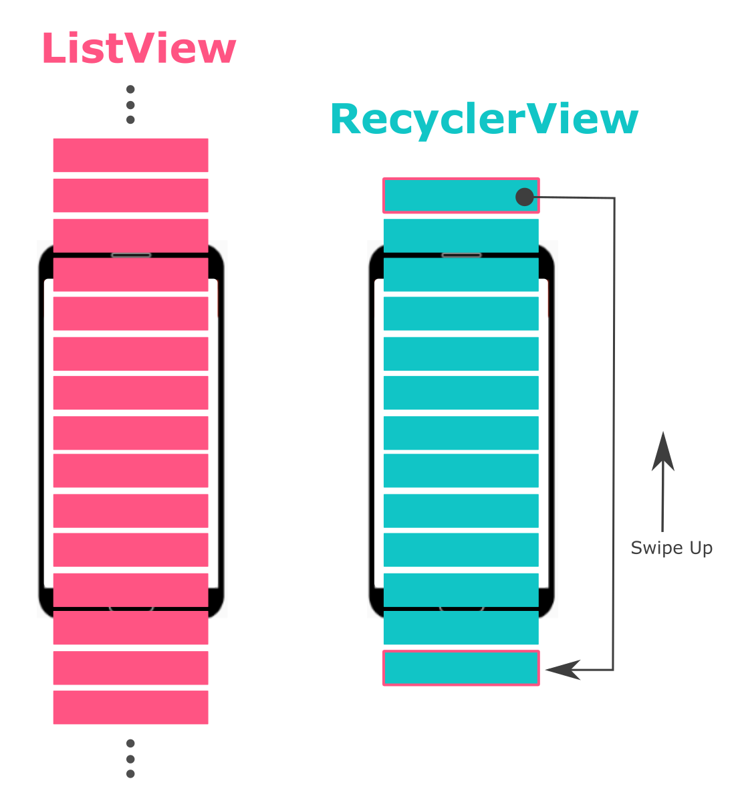
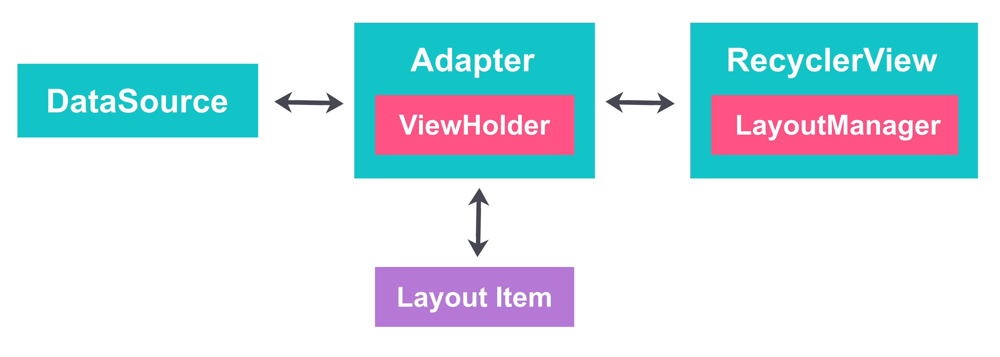
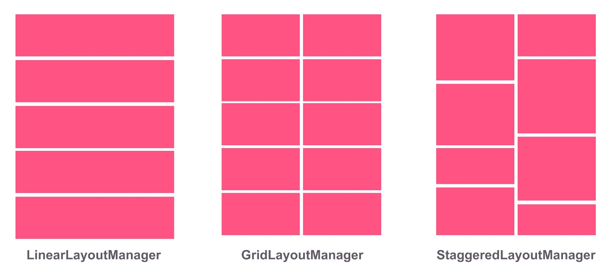

# RecyclerView

## RecyclerView vs ListView

RecyclerView merupakan sebuah elemen tampilan yang lebih canggih jika dibandingkan dengan ListView yang merupakan pendahulunya. Terdapat perbedaan antara ListView dan RecyclerView yang terlihat pada gambar di bawah ini. Apabila ingin menggunakan ListView, maka setiap item yang ditampilkan akan dibuat dari awal hingga akhir, sedangkan apabila ingin menggunakan RecyclerView, hanya objek yang diperlihatkan pada layar beserta beberapa item di atas dan di bawahnya saja yang akan dibuat. Selanjutnya, RecyclerView akan menggunakan kembali item-item yang tidak terlihat sehingga mengoptimalkan penggunaan memori.

Berikut ini adalah beberapa kelebihan ketika kita menggunakan RecyclerView.

* Memiliki memori yang ringan dan performa yang baik.
* Secara default memiliki ViewHolder.
* Mudah untuk memberikan animasi ketika menambahkan, memperbarui, atau menghapus item dengan ItemAnimator.
* Mendukung LayoutManager untuk mengubah tata letak.
* Mendukung pengguliran (scrolling) secara vertikal dan horizontal.
* Dapat digunakan bersama dengan DiffUtil.

## Bagian-bagian RecyclerView

Berikut adalah beberapa bagian yang perlu diketahui untuk menampilkan data dengan RecyclerView.

* **RecyclerView**: merupakan komponen ViewGroup yang perlu ditambahkan ke dalam berkas XML.
* **LayoutManager**: digunakan untuk mengatur tata letak item di dalam RecyclerView. Berikut beberapa opsi yang bisa dipilih
  

  * **LinerarLayoutManager** : tampilan satu kolom secara linear.
  * **GridLayoutManager** : tampilan lebih dari satu kolom atau grid.
  * **StaggeredLayoutManager** : tampilan menyesuaikan tinggi setiap item.

* **Data source**: sumber data yang akan ditampilkan ke dalam RecyclerView, biasanya berupa List/ArrayList.
* **Layout item**: berkas tampilan XML untuk setiap baris item.
* **RecyclerView.Adapter**: class yang digunakan untuk menghubungkan data source dengan RecyclerView. Di dalamnya terdapat beberapa fungsi berikut.

  * **onCreateViewHolder()**: digunakan untuk membuat ViewHolder baru yang terhubung dengan layout item.
  * **onBindViewHolder()**: digunakan untuk menetapkan data source ke dalam ViewHolder sesuai dengan posisinya.
  * **getItemCount()**: digunakan untuk menetapkan ukuran dari jumlah data yang ingin ditampilkan.

* **RecyclerView.ViewHolder**: digunakan untuk menentukan bagaimana data ditampilkan ke dalam Layout Item

## Langkah-langkah membuat RecyclerView

Berikut adalah langkah-langkah mengimplementasikan RecyclerView dari awal sampai data bisa tampil:

1. Menambahkan RecyclerView ke dalam layout.
2. Membuat berkas XML untuk layout item.
3. Membuat class baru dan menambahkan pewarisan RecyclerView.Adapter.
4. Membuat inner class dan menambahkan pewarisan RecyclerView.ViewHolder.
5. Di method onCreate() dalam Activity, buatlah RecyclerView dengan adapter dan layout manager.

## Materi Pendukung

<iframe width="560" height="315" src="https://www.youtube.com/embed/HtwDXRWjMcU" title="YouTube video player" frameborder="0" allow="accelerometer; autoplay; clipboard-write; encrypted-media; gyroscope; picture-in-picture" allowfullscreen></iframe>

<iframe width="560" height="315" src="https://www.youtube.com/embed/18VcnYN5_LM" title="YouTube video player" frameborder="0" allow="accelerometer; autoplay; clipboard-write; encrypted-media; gyroscope; picture-in-picture" allowfullscreen></iframe>

<< Sebelumnya  | **[Selanjutnya >>](recyclerview-exercise.md)**
